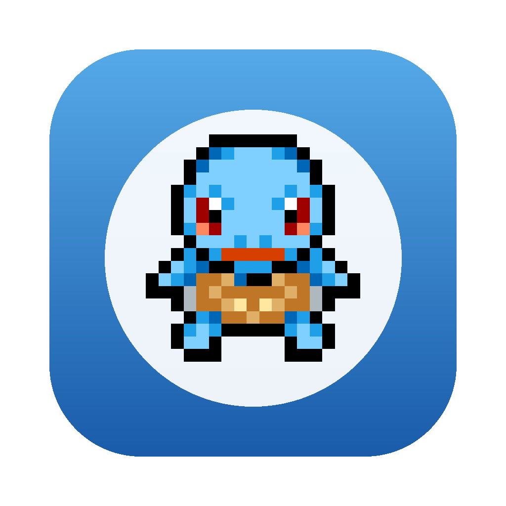
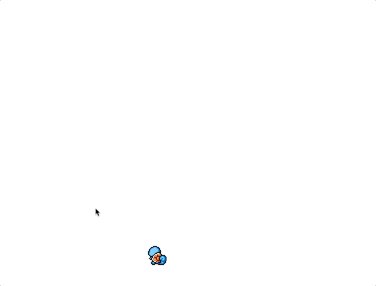
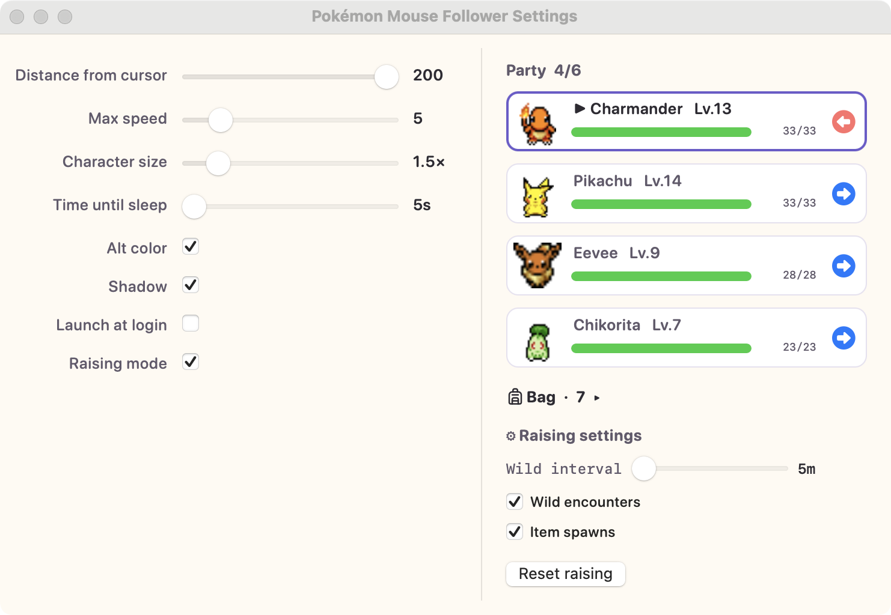

<p align="center">
  
</p>

<p align="center">
  <b>English</b> · <a href="README.ko.md">한국어</a> · <a href="README.ja.md">日本語</a>
</p>

# Pokémon Mouse Follower

A macOS menu-bar app: a Pokémon character wanders your screen and follows the mouse cursor. It runs in the background with no Dock icon — just a 🐾 icon in the menu bar.

<p align="center">
  
</p>

- 🐾 **Menu-bar only** — no Dock icon (`LSUIElement`)
- 🎯 **Physics-based following** — keeps a distance from the cursor and follows smoothly with its own speed/acceleration
- 🧭 **8-direction animation** — the sprite turns to face its movement direction
- 😴 **Idle → sleep** — falls asleep after staying still, wakes and follows when the cursor moves
- 🐱 **251 Pokémon (Gen 1 & 2)** — pick one in the GUI
- 🎮 **Raising mode** — starters, wild encounters, on-screen auto battles, EXP/evolution, catching, a six-mon party and a bag
- 🎨 **Alt-color variants** — alternate palettes for the 124 Pokémon that have them
- 🌏 **Localized** — English / Korean / Japanese (UI + Pokémon names)
- 🖥️ **Click-through transparent overlay** — never blocks the apps underneath
- 🖥️🖥️ **Multi-monitor** — crosses between displays seamlessly

## Requirements

- macOS 13 (Ventura) or later
- Apple Silicon / Intel (universal build)
- Xcode Command Line Tools (`swiftc`) — **only for building from source** (`xcode-select --install`)

## Install (no developer tools needed)

Download the `.dmg` from [Releases](https://github.com/LimFull/pokemon-mouse-follower/releases/latest). No Xcode / Swift required.

1. Download and open `PokemonMouseFollower-<version>.dmg`
2. Drag **Pokémon Mouse Follower** into the **Applications** folder
3. Launch it from Launchpad / Applications

## Install (build from source)

```bash
./build.sh install
```

Builds `PokemonMouseFollower.app` as a universal binary, ad-hoc signs it, copies it to `/Applications`, and launches it. The 🐾 icon appears in the menu bar and the character follows your mouse.

To only build:

```bash
./build.sh          # produces ./PokemonMouseFollower.app
open ./PokemonMouseFollower.app
```

> Source builds are ad-hoc signed, so Finder shows an "unidentified developer" warning on first open — right-click → **Open** once.
> Turn on auto-launch from the **Launch at login** option in Settings.

## Development

A quick iteration script: compiles an arm64 debug build and runs it in the foreground; logs print to the terminal and Ctrl+C quits.

```bash
./dev.sh
```

## Settings

Menu bar 🐾 → **Settings…** (`⌘,`), or relaunch the running app to open the window. Changes apply instantly and persist in `UserDefaults`.

The top of the window shows a live preview of the selected character (down-facing idle) with **◀ ▶** arrows to step through the roster and a **Random** button.

| Option | Range | Default | Description |
|---|---|---|---|
| Character | 251 | 007 Squirtle | Which Pokémon follows you |
| Distance from cursor | 0–200 px | 100 | Gap kept from the cursor |
| Max speed | 2–25 | 5 | Movement speed cap |
| Character size | 1.0×–5.0× | 2.0× | Sprite scale |
| Time until sleep | 5–120 s | 30 | Idle time before sleeping |
| Alt color | on/off | off | Use the alternate-color sprite (only the 124 Pokémon that have one) |
| Shadow | on/off | off | Draw a ground-shadow ellipse under the character (size from each Pokémon's `ShadowSize`) |
| Launch at login | on/off | off | Start automatically at login |

## Raising mode

Turn the follower into a Pokémon you actually raise. Flip **Raising mode** on in Settings, pick one of the six classic starters, and a party panel appears beside the settings.

<p align="center">
  
</p>

- 🌱 **Starters** — begin with one of the six classic Gen 1/2 starters
- ⚔️ **Wild encounters** — wild Pokémon spawn on your desktop and wander; walk into one and an auto battle plays out on the overlay with type match-ups, move effects and status conditions (sleep, burn, paralysis, freeze, confusion, …)
- ✨ **EXP → levels → evolution** — wins grant EXP; a "Level Up!" tag floats over the follower, new moves are learned (with a replace prompt at four), and evolutions play the classic white-out scene
- 🔴 **Catching** — enable capture in the bag and balls fly automatically when a weakened or statused wild looks catchable; party of up to six, swap who follows the cursor
- 🎒 **Bag & items** — items drop on the desktop and are picked up by walking over them; potions, balls and evolution items are used from the panel
- 💤 **Rest & recovery** — hurt members recover slowly out of battle, four times faster while the follower naps at your idle cursor, and the whole party fully heals at midnight (fainted members revive then)
- 🏃 **Mainline flee timing** — recalling mid-battle waits for the current turn to finish, and the mon keeps the damage (and ailment) it took

Progress is saved to `~/Library/Application Support/PokemonMouseFollower/raising.json`.

## Behavior

```
walk → stop → idle → [time until sleep] → sleep
                                   ↓ cursor moves
                                  walk
```

- Movement speed is independent of mouse speed. If the mouse moves too fast, the character lags behind and then catches up at its own speed.
- Starting from a stop, it accelerates smoothly from zero and decelerates to a halt near the cursor.

## Project structure

```
Sources/main.swift        The app (overlay window, sprite animation, physics, settings GUI)
Info.plist                Bundle config (LSUIElement, localization list)
build.sh                  Build universal .app + ad-hoc sign (+ install)
release.sh                Build + sign + package .dmg + publish
dev.sh                    Quick arm64 debug build + foreground run
fetch-shadows.sh          Download the -Shadow marker sheets
fetch-altcolors.sh        Download the alt-color sprite variants
Localizable/*.lproj       en / ko / ja strings
animations/<number>/      Per-character sprite sheets + AnimData.xml
```

Each character folder has `Idle-Anim.png`, `Walk-Anim.png`, `Sleep-Anim.png` and an `AnimData.xml` with frame-size info. Frame sizes differ per character, and the app slices them dynamically by reading `AnimData.xml`.

## Credits

- Sprites: [PMD Sprite Collab](https://sprites.pmdcollab.org/#/) — community-made pixel animations (assets downloaded from `spriteserver.pmdcollab.org`).
- Pokémon © Nintendo / Creatures Inc. / GAME FREAK inc.

This is a **non-commercial personal fan project**. All rights to Pokémon and related names/images belong to their respective owners.
